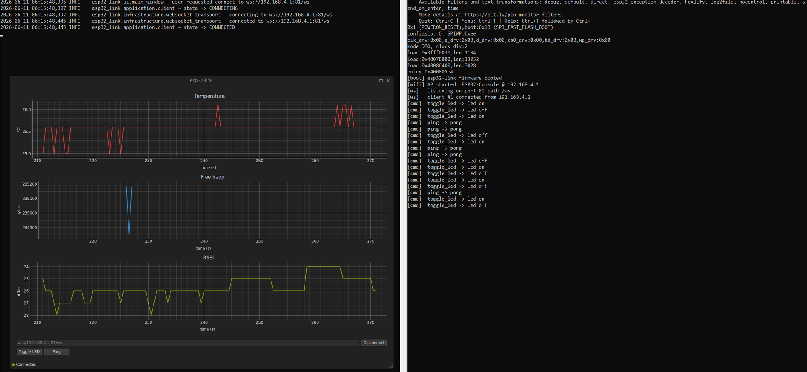

# esp32-link

*Aplikacja okienkowa na system GNU/Linux do komunikacji z płytką ESP32*

Project for the AGH course on object-oriented design (prof. Cyganek). A Linux
desktop app written in Python with PySide6 that talks to an ESP32-WROOM-32 over
Wi-Fi. The board runs a small AsyncWebSocket server in AP mode and pushes
telemetry (chip temperature, free heap, RSSI) at 2 Hz; the app draws three
live charts and lets you toggle the onboard LED or send a ping.

The point of the exercise is the design, not the gadget — the architecture and
the patterns used are documented in [`docs/`](docs/). The hardware demo is
just an excuse to have something to design *around*.



*Left: the desktop GUI with three live plots after about 4½ minutes of uptime.
Right: the ESP32 serial monitor showing boot lines, an incoming client, and a
log of `[cmd]` actions as the user clicked Toggle LED and Ping in the GUI.*

## Hardware

- ESP32-WROOM-32 dev board (CP2102 USB-UART), the kind with an onboard blue
  LED on GPIO 2.
- USB-A cable (data, not charge-only).
- A laptop with a 2.4 GHz Wi-Fi adapter; the ESP32 only does 2.4 GHz.

## Stack

- **Desktop:** Python 3.12, PySide6 (Qt 6), pyqtgraph, `websockets`, `uv` for
  env management.
- **Firmware:** PlatformIO + Arduino-ESP32, ESPAsyncWebServer + AsyncTCP,
  ArduinoJson v7.
- **Docs:** Markdown + PlantUML, pandoc for the optional PDF build.
- **CI:** GitHub Actions (Python tests + firmware compile).

## Quickstart (developer / repeat run)

```bash
# desktop
cd desktop
uv sync                # first time
uv run esp32-link      # launch the GUI
uv run pytest          # run the test suite

# firmware
cd firmware
pio run                       # build
pio run --target upload       # flash via USB
pio device monitor            # 115200 baud serial console
```

On Windows where `pio` isn't on PATH, `python -m platformio ...` works the same.

The GUI defaults to `ws://192.168.4.1:81/ws`. Connect the host Wi-Fi to the
`ESP32-Console` SSID (password `esp32pass`) before clicking Connect.

## Runbook (first-time tester / grader)

This walkthrough assumes Windows with WSL2 (Ubuntu) and WSLg — the same setup
the project was developed against. About 15 minutes of wall time, most of it
spent on PlatformIO downloading the ESP32 toolchain on first build.

> **Two terminals.** The firmware lives on the USB-attached ESP32 which only
> Windows can see, so the firmware steps (build / flash / serial monitor)
> happen in a **Windows PowerShell**. The desktop app needs a Linux Qt
> environment, so it runs in a **WSL (Ubuntu) terminal**. Each step below is
> tagged with which terminal to use.

### 1. Install the toolchains (one-off)

**[Windows PowerShell] — for the firmware:**

```powershell
# Requires Python on Windows. If you don't have it: https://www.python.org/downloads/
pip install --user platformio
```

The installer prints a path like
`C:\Users\<you>\AppData\Local\Python\pythoncoreXY-64\Scripts` and warns it
isn't on `PATH`. That's fine — every PlatformIO command in this runbook uses
the `python -m platformio …` form which doesn't need `PATH`.

**[WSL] — for the desktop app:**

```bash
# uv (Python env manager). Adds itself to ~/.local/bin/
curl -LsSf https://astral.sh/uv/install.sh | sh
```

Modern Ubuntu (24.04+) blocks `pip install` outside a virtualenv. If you
want PlatformIO inside WSL too (not required — see the note above), use
`sudo apt install pipx` then `pipx install platformio`.

### 2. Build and flash the firmware

**[Windows PowerShell]**, with the ESP32 connected via a **USB-data** cable
(charge-only cables will not enumerate):

```powershell
cd C:\Users\<you>\Desktop\…\esp32-link\firmware
python -m platformio device list           # confirm the board appears as COMx
python -m platformio run --target erase    # optional, wipes any old firmware
python -m platformio run --target upload   # builds + flashes; ~5-10 min on first run
python -m platformio device monitor        # 115200 baud, Ctrl+C to quit
```

On the serial monitor, within a second of reset:

```
[boot] esp32-link firmware booted
[wifi] AP started: ESP32-Console @ 192.168.4.1
[ws]   listening on port 81 path /ws
```

If those three lines appear, the firmware is healthy.

> **Why not WSL for this step?** WSL2 doesn't see USB devices by default.
> `pio device list` in WSL will return empty. There is a workaround
> (`usbipd-win`), but it's extra setup. PlatformIO on Windows is the path of
> least resistance.

### 3. Join the ESP32's Wi-Fi

From **Windows Wi-Fi settings** (the laptop is the station, the ESP32 is the
AP):

| SSID | Password |
|------|----------|
| `ESP32-Console` | `esp32pass` |

The host gets `192.168.4.2` via DHCP. Windows will say "no internet" — that's
expected, the ESP32 isn't a router.

Keep the serial monitor from step 2 open in PowerShell if you want to watch
the `[ws] client #1 connected` line appear later.

### 4. Run the desktop app

**[WSL]**:

```bash
cd /mnt/c/Users/<you>/Desktop/…/esp32-link/desktop
uv sync                # one-off, ~2 min, downloads Qt
uv run esp32-link      # dark window opens via WSLg
```

Click **Connect**. The status badge should go yellow (Connecting) for under a
second, then green (Connected), and the three plots begin filling at 2 Hz.

### 5. What to verify

- **Temperature plot** climbs slowly from room temperature toward ~30 °C as the
  chip warms up under Wi-Fi load.
- **Free heap plot** is a flat green line around 235 kB with brief dips to
  ~234.9 kB once or twice a minute (that's the AsyncWebSocket buffer cycle —
  see `docs/04-protocol.md`). Flat = no memory leak.
- **RSSI plot** sits around −40 to −50 dBm; moving the laptop closer or farther
  from the board should visibly shift it.
- Clicking **Toggle LED** in the GUI flips the blue LED on the board on/off,
  and the serial monitor logs `[cmd] toggle_led -> led on` (or `off`).
- Clicking **Ping** is silent in the GUI but the monitor shows
  `[cmd] ping -> pong`.

Above screenshot shows this state.

### 6. WSL2 networking gotcha

WSL2 default NAT routes 192.168.4.1 through the wrong adapter when ethernet is
also plugged in. If `ping 192.168.4.1` from inside WSL returns "Network is
unreachable" while the same command from Windows replies in 2 ms, add to
`%USERPROFILE%\.wslconfig`:

```ini
[wsl2]
networkingMode=mirrored
firewall=false

[experimental]
hostAddressLoopback=true
```

Then `wsl --shutdown` in PowerShell and reopen WSL. The Wi-Fi adapter should
appear in `ip addr` with the `192.168.4.x` address.

## Repository layout

```
esp32-link/
├── desktop/      # Python + PySide6 application (src layout)
│   ├── src/esp32_link/{domain,infrastructure,application,ui}
│   └── tests/
├── firmware/     # PlatformIO project (one main.cpp)
└── docs/         # docs + PlantUML diagrams + screenshots
```

## Documentation

The whole writeup lives under [`docs/`](docs/):

1. [Requirements](docs/01-requirements.md)
2. [Architecture](docs/02-architecture.md)
3. [Design patterns](docs/03-design.md) — the main grade-bearing piece
4. [Wire protocol](docs/04-protocol.md)
5. [Connection state machine](docs/05-state-machine.md)
6. [Testing](docs/06-testing.md)
7. [Build and run](docs/07-build-and-run.md)

UML diagrams are in [`docs/uml/`](docs/uml/) as `.puml` source. Render them
with [plantuml.com](https://www.plantuml.com/plantuml/uml/) or any
PlantUML-capable viewer. To build a single PDF from the markdown set, run
[`docs/build.sh`](docs/build.sh) (needs `pandoc` and a LaTeX engine).

## Known limitations / things I learned the hard way

- The first version of the firmware applied a Fahrenheit→Celsius conversion on
  `temperatureRead()` based on the Arduino-ESP32 major version. That was
  correct for older 2.x releases but wrong for 2.0.14+, which already returns
  Celsius. Symptom: chart showed −3 °C at room temperature. Fixed by dropping
  the conversion. On my board the sensor now reads ~24 °C in a 22–23 °C room.
  Per-chip variance is a couple of degrees either way; see
  [`docs/04-protocol.md`](docs/04-protocol.md) for the gory details.
- WSL2's mirrored networking mode doesn't always pick up the Wi-Fi adapter on
  the first try. If `ping 192.168.4.1` from inside WSL says "Network is
  unreachable" while it works from Windows directly, see step 6 of the runbook
  above.
- The reconnect logic loops forever at 8 s once backoff caps out. There is no
  "give up" button — you click Disconnect to stop it.

## License

[MIT](LICENSE). Use it, fork it, break it.
